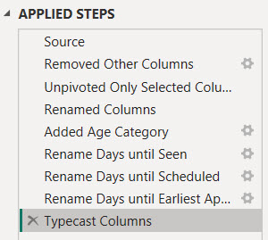
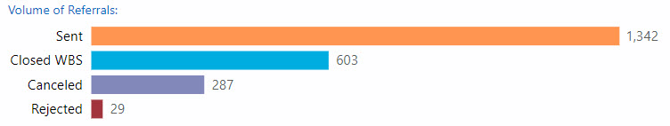

< [Portfolio](https://907sjl.github.io) | [Full Report](https://907sjl.github.io/pdf/Clinic%20Wait%20Times.pdf) | [PBIX File on GitHub](https://github.com/907sjl/clinic-wait-powerbi/blob/main/Clinic%20Wait%20Times.pbix) | [Overview](https://907sjl.github.io/clinic-wait-powerbi/clinic_wait_report)    

One way to measure access to care is timeliness.  Long delays to see a healthcare provider can speak to availability issues, either a lack of resources or inefficiencies that result in a less than optimal conversion of referrals into appointments. Long delays can also speak to accommodation issues or accessibility issues if patients have difficulty attending their scheduled appointments.
This project is an example of a report that I created to look at the wait times for referred patients at specialty clinics. 

## Why Power BI? 
Why would I choose Power BI to create this report?  Power BI reports are both quick to manipulate and page formatted.  The combination of Power Query M Scripts and DAX measure calculations makes Power BI extremely nimble, as does the visual design interface for building reports.  There is a plethora of community support and freely accessible training for those who are new to Power BI.  A dashboard created in Power BI can also function as a page formatted report.  If you are faced with a typical business intelligence, rapid and iterative prototyping scenario where exploratory analysis is refined into repeatable process measurement then Power BI is a good choice.    

## Overview
Click [here](https://907sjl.github.io/clinic-wait-powerbi/clinic_wait_report) for an overview of the report.  All data in these reports is fabricated and does not represent any real healthcare organization.  The script that created the data for this example can be found [in the create_referral_data folder](https://github.com/907sjl/referrals_powerbi/tree/main/create_referral_data).    

## Data sources 
For the purposes of demonstration this example report loads data from two Comma Separated Values files.    

- Referrals.csv
: A file containing one row for each referral and columns with the dates when each referral reached a process milestone.  Other columns are also included that are helpful for monthly monitoring.    

- StandardCalendar.csv
: Contains the data for the standard date dimension table used across reports.     

## Power Query ELT
    
Four custom groups and the one default group organize the Power Query loads, transforms, and ancillary constructs. 

### Parameters and Functions
    
Parameters are used here for two purposes.  The **data_date** parameter is used to fix the effective date of this report to a specific date. Many of the measures 
in this report are based on the age of a referral. Since this example is loaded from static files the effective date must be fixed in time in order to avoid every 
referral aging out of range.    

```
= Table.AddColumn(#"Set Data Types", "Days to Accept", each if ([Date Accepted] = null) 
  then Duration.Days(Date.From(data_date) - [Date Referral Sent]) 
  else Duration.Days([Date Accepted] - [Date Referral Sent]))
```    
The **data_date** parameter is used to calculate the number of days that a referral waited to reach each of the process milestones, but only when a referral 
hasn't yet reached the milestone by the data date.    

    
The **data_path** parameter provides a single, convenient location to set the directory where the report can find the data files to load. The *Source* step of 
each source table references this parameter along with one of the other parameters containing the name of the file to load.    

    
This Power Query ELT makes use of the **GetAgeCategory** function to template a column transform. The function assigns a distribution grouping bin to the number 
of days leading up to a process milestone. Encapsulating business logic into functions places that logic in an easy to find location. It also templates a 
transformation that may potentially be used more than once. Changes can be made in a single place.    

```
= (Days as any) as any => 
let
    Source = (if Days = null then null 
              else if Days <= 7 then "7d" 
              else if Days <= 14 then "14d" 
              else if Days <= 30 then "30d" 
              else if Days <= 60 then "60d" 
              else if Days <= 90 then "90d" else ">90d")
in
    Source
```    
The number of days is the parameter and the return value is the grouping bin name.    

### Data Loads
    
The Data Loads group contains the extracts and loads from the source data files. **Referral** and **Standard Calendar** each refer to the similarly named CSV file 
data source.  

### Referral Table 
The query for the **Referral** table loads records of referrals and processing dates from referrals.csv.   
    
This source file contains a horizontal list of columns representing the dates that each referral first reached processing milestones such as the date written, date 
sent, accepted, scheduled, and seen.    

    
Table transforms add columns that indicate whether or not the referral has reached each process milestone.  These are used by DAX measures in the report.    

Adding calculated columns in Power Query balances out the overall time spent waiting for calculations while working with Power BI reports. Calculations and filters 
written into DAX measures are processed when the filters change, the view page is changed, or visualization properties are changed. Loading a calculated column in 
Power Query shifts some processing to the data refresh.   

    
The number of days between milestones are also added to the table as calculated columns. These columns are used to age referrals from the date when they are sent. 
These ages are used to calculate median process timings.    

### Processing Time Table  
    
**Processing Time** is a pivoted transformation of the referral process metrics into a vertical fact table rather than a horizontal list of milestone attributes. 
Doing so grants the ability to filter visuals to specific metrics and apply the same aggregation across one or more selected metrics. Using this data structure 
also simplifies the use of bar charts to place different metrics side by side for comparison.    

Pivoting a horizontal list of milestone columns into a vertical fact table results in a simplified data model in that there are fewer dimensions playing a single 
role. There is a single relationship between the dimension table and the fact table instead of multiple sub-classes of age category, for example.    

The transforms:
1. Reference the source **Referrals** table
1. Select the columns that are relevant for this table
1. Unpivot from a horizontal list of milestone dates and times to a vertical list
1. Tag each milestone wait time with an age category (using the **GetAgeCategory** function)
1. Clean up the source file naming and data types

    
Care has to be taken with this fact table because the days to each referral milestone are not additive. In the example above the days until seen includes the days 
to accept and the days until scheduled. The total days including all milestones is 13 days, and that is meaningless. The median days to any one milestone across all 
referrals is meaningful, however.    

### Standard Calendar Table 
The query for the **Standard Calendar** table loads records of calendar dates and their pivotal attributes from StandardCalendar.csv. This query simply loads the 
file and typecasts columns. These records are used to create the date dimension for the report. This dimension can play different roles in the data model by 
associating it with different date attributes in DAX measures.   

### Dimension Tables 
    
The queries in the Dimensions group fill tables representing the pivotal dimensions for reporting. These tables can be related to multiple other tables that contain 
facts used in measures. They can also contain attributes used to sort or filter dimension values in visualizations by something other than the dimension name.    

Three dimensions are entered into the Power Query and stored as JSON: 
- **Age Category** is a table of bins used to group referrals in timing distributions.  
- **Process Metric** is a table of referral process milestones and other time calculations used to monitor performance.  

The **Clinic** dimension is sourced from the **Referral** table and represents the list of unique clinic names where referrals are sent.    

### Other Tables 
    
The default Other Queries group has one remaining table that doesn't fit with the other groups. The **Report Measure** table is used to place separate metrics 
side-by-side in bar charts with axis labels. Measures are added to a visualization by filtering on the **Report Measure** table instead of adding them to the visualization design.    

    
The records of the **Report Measure** table are entered into the Power Query and stored as JSON. The name of each measure is stored along with columns that can be 
used to group measures together. Bundles of related measures can be selected for a visualization by filtering on these columns.    

```
Measured Whole Number Value = 
    SWITCH(MIN('Report Measure'[Measure Name]), 
        "Count of Aged Referrals Scheduled", [Count Referrals Linked after 90d], 
        "Count of Aged Referrals or Similar Appointment Scheduled", [Count Referrals or Similar Appt Scheduled after 90d],
        "Count of Aged Referrals Seen or Checked In", [Count Referrals Seen after 90d],
    ...
```    
A DAX measure surfaces data for selected measures using a SWITCH statement on the measure name to pair it with the corresponding formula in DAX.  

## Power BI Data Model 
<a href="images/data_model.jpg"></a> 
Two tables host measures that are surfaced in report visualizations.  The **Referral** and **Processing Time** tables contain fact values.    

Three data dimensions other than the **Standard Calendar** date table are persisted as separate tables, **Age Category**, **Clinic**, and **Process Metric**.    

    
The **Age Category** dimension table has an added column with a pre-defined sort order. The sequence of the sort order reinforces the contextual meaning of the 
dimension name. This sorting is neither based on alphabetical order nor volume of data. This dimension's name column has its sort order overridden by the SortOrder 
column.    

The **Clinic** dimension is used to facilitate a slicer and to provide a single table that filters all related fact tables simultaneously.    
    
This slicer is an example of filtering a dimension table versus an attribute of a table. The **Clinic** dimension table has a one-to-many relationship to the 
**Referral** table, and by logical transition the **Processing Time** table. Selecting a clinic value with the slicer will filter any measures that use the 
**Referral** or the **Processing Time** table. Connecting the slicer to the **Clinic** table also makes the slicer independent of the current, 
filtered data set of referrals so that it always shows a complete list of clinics.    

**Process Metric** allows visuals or measures to filter the **Processing Time** table to either one milestone and then to sort the milestones in a semantic ordering 
instead of by name.    

The **Standard Calendar** table is the time dimension. It is a table of calendar dates and attributes such as year and month that are used to filter and sort 
visualizations by date.    

A time dimension table is also required to use the time intelligence functions in DAX.    

## Power BI Report

In the scenario where this report is used we did not have access to the Power BI cloud service. Customers receive PDF exports of report pages. The free Desktop version 
of Power BI easily handled this and allowed for agile adjustments during the iterative investigation into valuable metrics. Without the cloud premise there is no 
option for automating the delivery. So then the next step to operationalize this report would be to move it to the cloud or manually export it to PDF each month.    

Click [here](https://907sjl.github.io/clinic-wait-powerbi/clinic_wait_report) for an overview of the report. The following sections describe the DAX measures behind 
some of the visualizations.    

This report surfaces the median wait time for patients who are referred to specialty clinics. The wait time is the number of days to the date of the earliest appointment 
that was scheduled from the date when the clinic received the referral. Additional details are provided to understand the population of referrals that are sampled 
and the referral process timings for each of the clinics.    

### Referral Status 
    
A referral will be in one of eight states from a process perspective. A referral is written in the Clinic Referral Management system then sent to the specialty clinic. 
The referral is considered pending acceptance when it is sent. After that point the referral is either accepted, cancelled, rejected, or sometimes closed because the 
referral must be forwarded to another organization. The clinic accepts and schedules a referred patient after the case has been reviewed. The patient is then seen and 
the referral is completed with a visit summary.    

### Days to Earliest Appointment with Distribution    
    

In this histogram the wait times are binned into groups by the number of days until the earliest appointment that was scheduled. The bins are uneven but practical. 
All referrals are included regardless of whether they were seen in the clinic to avoid cherry-picking the successes. Referrals that are not yet seen as of the report 
date are still waiting and are included in the >90d bin. The inclusion criteria requires that a referral reach 90 days of age before measuring and so any referral 
still waiting falls into that category.    

The number of referrals in each category are shown at the bottom of each bar and the percentage of the total is shown above each bar. The median value for the clinic 
is included as an annotation above the chart.     

This visualization is built upon a few layers of DAX measures.  
```
Moving 364d Count by Milestone after 90d = 
MAX(
  CALCULATE(DISTINCTCOUNTNOBLANK('Processing Time'[Referral ID])
    , KEEPFILTERS(Referral[# Aged] > 0) 
    , DATESBETWEEN('Standard Calendar'[Date]
                   , [Moving 364d Start Date for 90d Aged] 
                   , [Last Data Date for 90d Aged] ) )
  , 0)
```    
The core layer calculates the number of referrals within a 364 day window. The **Processing Time** table is a reverse pivot in the Power Query to create a long 
table of referrals and their process milestones as dimensions and the number of days to reach each milestone as a fact value. This measure calculates the number 
of referrals by milestone.    

DAX has many time intelligence functions available as syntactic sugar. I've found that the simplest and most maintainable pattern for using different periods in 
one report is just the DATESBETWEEN function on the date table using two other measures for the starting and ending dates.    

```
Moving 364d Start Date for 90d Aged = 
    MAX('Standard Calendar'[Date]) - 364 - 89 
```    
```
Last Data Date for 90d Aged = 
    MAX('Standard Calendar'[Date]) - 90
```    

The choice of 364 days is intended to reduce the jitter in the results across different dates in historical line charts. Most clinics do not see patients on 
Sunday and so having the same number of Sundays in every sample helps to make the results more comparable between samples.    

Moving measures like this one start by calculating across a window that includes every selected calendar date in the current filter context. Another layer builds upon 
this measure to specifically select the most recent date from which to then calculate a 364-day window.    

```
Ending 364d Count by Milestone after 90d = 
    CALCULATE([Moving 364d Count by Milestone after 90d]
              , LASTDATE('Standard Calendar'[Date]))
```    

This measure creates a filter context with only one date, the last date in the current filter context, and then invokes the moving total measure within that 
more focused context. Power BI calls this *context transition*.    

A slicer on the report page selects a single month at a time as the overall filter context that is then manipulated by these nested measures, each with their 
own local context derived from the global report filter context. The LASTDATE function is selecting the last date within the data set created by the slicer. 
Then after context transition the MAX function in the nested measure creates a new context that only includes one date.    
    

The **Referral** table and the **Standard Calendar** table share a relationship on the date when the referral is sent to the clinic. Filtering **Standard Calendar** 
also filters **Referral** by the date when the clinic received the referral.        

One final layer of DAX selects a specific milestone from among the multiple referral process milestones that are included in the count.    

```
Ending 364d Count by Earliest Appt after 90d = 
    CALCULATE([Ending 364d Count by Milestone after 90d]
              , KEEPFILTERS('Process Metric'[Metric]="Days until Earliest Appt"))
```    

The date of the earliest appointment scheduled is one milestone among others such as when the referral was accepted, when it was first scheduled for any appointment, 
when the patient was finally seen, and when the visit note and referral was completed.    

Median days to the earliest appointment is calculated using the same layered pattern of measures.  The core nested measure calculates the median instead of a 
count of referrals.    

### Volume of Referrals and Dispositions    
    

Referrals are included in the wait time measurement if they are sent to a clinic and have reached 90 days of age after that occurs. There are a few dispositions that 
also eliminate referrals from the measurement. If the clinic rejects the referral after review then the rejected referral is excluded as are canceled referrals. 
Some referrals must be forwarded to another healthcare organization and are closed without any further tracking. This bar chart shows the volume of referrals by the 
number originally sent and then the number of referrals in each of the exclusion categories.    

Two layers of DAX measures calculate the counts in this bar chart.    

```
Count Referrals Sent Prev 12-Mths = 
MAX(
  CALCULATE(SUM(Referral[# Sent]) 
    , DATESBETWEEN('Standard Calendar'[Date]
                   , [Moving 364d Start Date for 90d Aged]
                   , [Last Data Date for 90d Aged]) )
  , 0)
```    

The first layer counts the number of referrals sent in the moving 364-day window. This is the same approach described above 
for the histogram of wait times where DATESBETWEEN is used with two measures for the starting and ending dates.    

```
Count Referrals Rejected Prev 12-Mths = 
  CALCULATE([Count Referrals Sent Prev 12-Mths] 
    , KEEPFILTERS(Referral[Referral Status] IN {"Rejected"}) )

Count Referrals Canceled Prev 12-Mths = 
  CALCULATE([Count Referrals Sent Prev 12-Mths] 
    , KEEPFILTERS(Referral[Referral Status] IN {"Cancelled"}) ) 

Count Referrals Closed WBS Prev 12-Mths = 
  CALCULATE([Count Referrals Sent Prev 12-Mths] 
    , KEEPFILTERS(Referral[Referral Status] IN {"Completed", "Closed"} 
        && ISBLANK(Referral[Date Referral Seen]) 
        && ISBLANK(Referral[Date Patient Checked In])) )  
```    

Then additional measures leverage the count of referrals sent to further filter by the referral states to be excluded.    

Enabling these measures to appear in the same, horizontal bar chart with pithy labels requires an extra layer of indirection. The bar chart visual needs a single 
table and a single measure with dimensions that can be used to pivot data by. **Report Measure** is that table and contains the measure named **Measured Whole Number Value**.    

```
Measured Whole Number Value = 
  SWITCH(MIN('Report Measure'[Measure Name]), 
    "Count Linked after 90d", [Count Linked after 90d], 
    "Count Scheduled after 90d", [Count Scheduled after 90d],
    "Count Tagged as Seen after 90d", [Count Tagged as Seen after 90d],
    "Count Seen or Checked In after 90d", [Count Seen or Checked In after 90d],
    "Count Rejected after 90d", [Count Rejected after 90d],
    "Count Canceled after 90d", [Count Canceled after 90d],
    "Count Referrals Closed WBS after 90d", [Count Referrals Closed WBS after 90d],
    "Count Sent after 90d", [Count Sent after 90d],
    ...
```    

**Measured Whole Number Value** is a single measure that acts as a switchboard of measures. It assumes that the current filter context only allows a single value in 
the **Measure Name** column of the **Report Measure** table. This measure is assigned to the bar chart visual as the X-axis.   
    
This plots the values returned from one of the measures in the switchboard and also allows separate measures from that switchboard to appear side-by-side as bars 
with labels in the Y-axis. The labels are attribute columns in the **Report Measure** table. The measures to use in a visual are selected by filtering those 
attributes in the report designer.    
    
This visual includes specific measures with an attribute value of **Prev12m** in the **Milestone** column and **All** in the **Priority** column. There can be more 
than one measure with the same label but different time windows. If this report is published interactively in the cloud service this also introduces interesting 
capabilities for the viewer to customize the page by changing these filters.    

### Process Rates After 90 Days 
    
Referrals are aged if they are sent to a clinic and kept. Aged referrals are included in process metrics and wait time calculations. This bar chart compares the number 
of referrals that have reached each of the process milestones 90 days after they are sent.    

Using the same pattern as the volume calculations described above, these counts by process milestone are built using two layers of DAX.    

```
Ending 364d Count Aged after 90d = 
    CALCULATE([Ending 364d Count Sent after 90d]
              , KEEPFILTERS(Referral[# Aged] = 1))
```    

The DAX measures for this chart are based on the number of aged referrals. The number of referrals sent is first filtered down to the number aged, or kept. 
Aged referrals are those that are sent to a clinic and not rejected, canceled, or closed without being seen. **# Aged** is calculated for each referral in 
Power Query a 1 or 0 as a convenience column to make DAX measures easier to read and use.    

``` 
Ending 364d Count Accepted after 90d = 
CALCULATE([Ending 364d Count Aged after 90d]
    , KEEPFILTERS(Referral[# Accepted] > 0))

Ending 364d Count Scheduled after 90d = 
CALCULATE([Ending 364d Count Aged after 90d]
   , KEEPFILTERS((Referral[# Linked to Appts] > 0) || (Referral[# Similar Appts Scheduled] > 0)))

Ending 364d Count Completed after 90d = 
CALCULATE([Ending 364d Count Aged after 90d]
    , KEEPFILTERS(Referral[# Completed] > 0))
    
Ending 364d Count Seen after 90d = 
CALCULATE([Ending 364d Count Aged after 90d]
    , KEEPFILTERS(Referral[# Referrals Seen or Checked In] > 0))
```    

The remaining measures in the bar chart filter the aged measure to count referrals that have reached specific milestones, reached 90 days of age, and were not 
rejected, canceled, or closed without being seen.    

These measures are also wrapped by the **Measured Whole Number Value** measure described above and included as entries in the **Report Measure** table so that 
they can be displayed side-by-side in a bar chart visual.    

Measures of referral counts by process milestone achieved are then leveraged to calculate the pace at which clinics reach those milestones within 90 days.    

    

An annotation above the bar chart displays the rate of meeting each milestone and the median days required.    

```
Ending 364d Rate Accepted after 90d = 
DIVIDE([Ending 364d Count Accepted after 90d], [Ending 364d Count Aged after 90d], 0)

Ending 364d Rate Scheduled after 90d = 
DIVIDE([Ending 364d Count Scheduled after 90d], [Ending 364d Count Aged after 90d], 0)

Ending 364d Rate Seen after 90d = 
DIVIDE([Ending 364d Count Seen after 90d], [Ending 364d Count Aged after 90d], 0)

Ending 364d Rate Completed after 90d = 
DIVIDE([Ending 364d Count Completed after 90d], [Ending 364d Count Aged after 90d], 0)
```

The rate calculations leverage the measures used to calculate counts.    

Annotations with the median days to each process milestone are listed next to the completion rate for each milestone. These annotations use the same measure 
as the median days to the earliest appointment shown above in the histogram of referrals by wait time.    

```
Ending 364d Median Days to Milestone after 90d = 
    CALCULATE([Moving 364d Median Days to Milestone after 90d]
        , LASTDATE('Standard Calendar'[Date])) 
```    

This measure returns the median days across all milestones from the **Processing Time** table and must be filtered to specific milestones. The card 
visuals with the number of days to accept, schedule, see, and complete referrals each filter this measure in the report designer.    

### Rate Seen, Waiting, or Unmet    
    
After 90 days the number of referrals seen, those scheduled and waiting for their appointment date, and those not yet scheduled are displayed with their relative 
proportions in a pie chart.    

```
Ending 364d Count Seen after 90d = 
CALCULATE([Ending 364d Count Aged after 90d]
    , KEEPFILTERS(Referral[# Referrals Seen or Checked In] > 0))

Ending 364d Count Scheduled after 90d = 
CALCULATE([Ending 364d Count Aged after 90d]
   , KEEPFILTERS((Referral[# Linked to Appts] > 0) || (Referral[# Similar Appts Scheduled] > 0)))

Ending 364d Count Not Scheduled after 90d = 
   [Ending 364d Count Aged after 90d] - [Ending 364d Count Scheduled To Be Seen after 90d] - [Ending 364d Count Seen after 90d] 
```    
These are the same measures used in the process rates with the addition of a derived calculation of referrals that were not processed.     

```
Ending 364d Rate Seen after 90d = 
DIVIDE([Ending 364d Count Seen after 90d], [Ending 364d Count Aged after 90d], 0)
```    
The percentage of referrals seen after 90 days is also repeated here for emphasis. The headline for this page is the number of referrals seen 
versus those waiting to be seen and those that were not scheduled. Referrals that are not scheduled are labeled as unmet.    

### Days to Seen vs. Days as Scheduled
    
Wait time for clinics, in this report, is the days to the earliest appointment that was scheduled. This is the earliest appointment that worked for both the patient 
and the clinic. Appointments can be rescheduled, cancelled, or the patient simply doesn't show. These outcomes increase the time required to see referred patients 
and can cost the clinic valuable time.    

This area chart illustrates the gap between the days to see patients as scheduled versus the days to actually see the patients. The x-axis is the days to see 
patients grouped into bins just like the histogram described above. The y-axis is the percentage of referred patients seen in that time.    

```
Cum 364d Count Referrals by Earliest Appt after 90d = 
CALCULATE([Ending 364d Count by Earliest Appt after 90d] 
    , FILTER(ALL('Age Category'), 'Age Category'[SortOrder] <= MAX('Age Category'[SortOrder])) ) 

Cum 364d Denominator by Earliest Appt after 90d = 
CALCULATE([Ending 364d Count by Earliest Appt after 90d] 
    , ALL('Age Category') ) 
```    
The lines that form the curves are cumulative across the age bins. Context transition is required to accomplish the cumulative counts used to calculate the 
cumulative rates. CALCULATE and FILTER work together to create a new filter context for these measures that includes all Age Category bins instead of just the 
**Age Category** values in the filtered context, then all **Age Category** values are filtered to those that come prior to the latest age category in the 
current filter context.  The cumulative measure will be called to calculate a count for each individual age category bin in the chart visual's x-axis. Then 
for each of those x-axis values, these measures with their context transition will include all age categories that are prior to and including the x-axis value 
that they were called for.    

```
Cum 364d Rate Referrals by Earliest Appt after 90d = 
  DIVIDE( 
    [Cum 364d Count Referrals by Earliest Appt after 90d] 
    , [Cum 364d Denominator by Earliest Appt after 90d] 
    , 0) 
```    
Then the cumulative rate is calculated in a DIVIDE function that calls each of the cumulative count measures.    

### Data Driven Colors    
    
Bar chart visuals provide a way to color the bars using measures. By design, measures can be attached to bars in the configuration of the visual 
to select colors based on the data used to plot the bar. If you plan to use the same color rules in more than one column or visual this creates redundant work 
to set up and maintain the visuals.    

A more maintainable approach is to use a single measure that embeds the ladder of rules and selects the appropriate color for the data within 
the current filter context.    

```
Color by Category = SWITCH(
  MAX('Age Category'[Age Category]) 
  , "7d", [Color 7d] 
  , "14d", [Color 14d] 
  , "30d", [Color 30d] 
  , "60d", [Color 60d] 
  , "90d", [Color 90d] 
  , ">90d", [Color Over 90d] 
) 

```    

The color values in this example project are simply DAX measures defined as constant values. The measure pairs a color value 
with a semantic meaning. This works for a simple report and is easy to maintain as long as the measures are grouped and named 
so that they are found easily. A color rule table could also be used in more complicated scenarios.    

```
Color 7d = "#55BCFF"
Color 14d = "#AADAFF"
... 
Color Over 90d = "#FD6262"
```    

Color values can be changed at once across multiple sets of rules that use the colors in multiple visuals. The constant color measures allow colors to be 
changed in this way across the report. Power BI doesn't allow all color properties to be data driven with measures, unfortunately. Older tools like QlikView 
were more customizable in this way. Hopefully Microsoft will come around to creating more measure hooks for configuration properties.    

### Display Folders for Data Elements
    
This report resulted in a large collection of measures with different inclusion criteria that build upon one another. These measures are organized into display folders 
as are the table attributes. The measures are organized by the time frame of the inclusion criteria.    

< [Portfolio](https://907sjl.github.io) | [Full Report](https://907sjl.github.io/pdf/Clinic%20Wait%20Times.pdf) | [PBIX File on GitHub](https://github.com/907sjl/clinic-wait-powerbi/blob/main/Clinic%20Wait%20Times.pbix) | [Overview](https://907sjl.github.io/clinic-wait-powerbi/clinic_wait_report)    

<p style="font-size:11px">Page template forked from <a href="https://github.com/evanca/quick-portfolio">evanca</a></p>
<!-- Remove above link if you don't want to attibute -->
